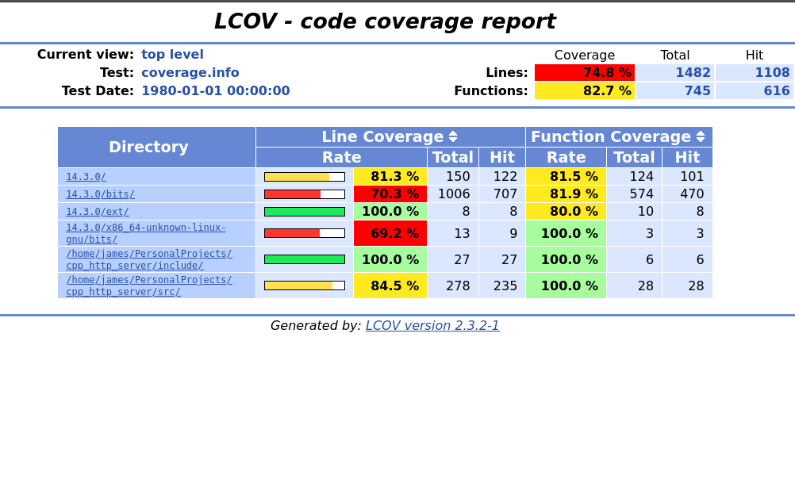
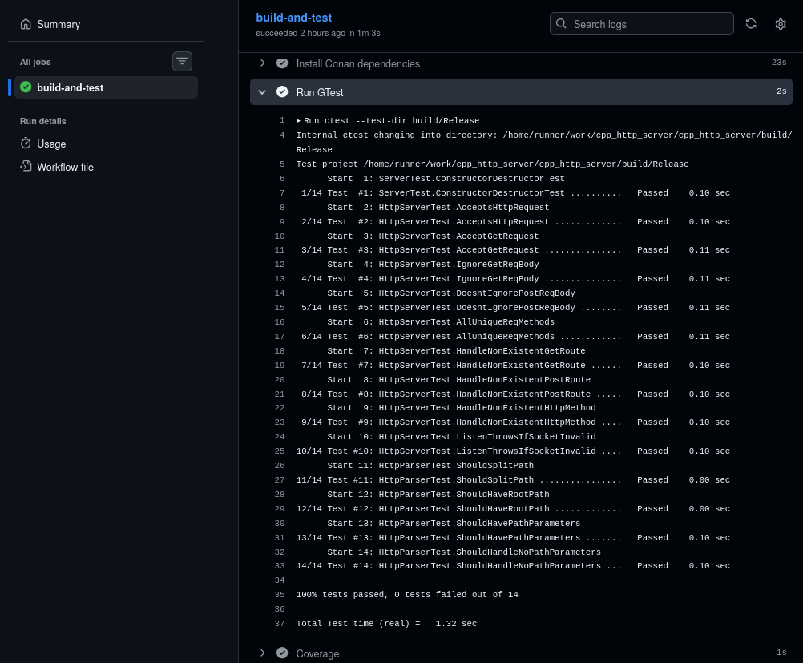
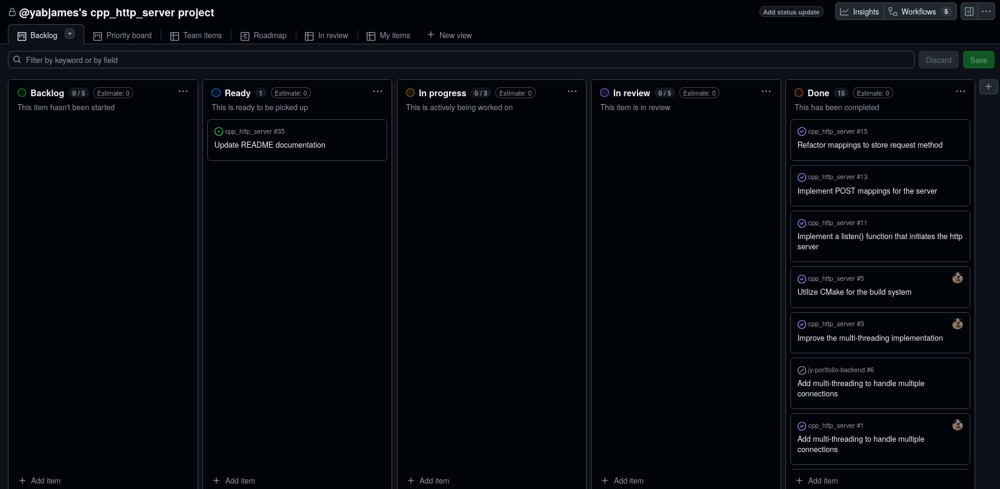

# C++ HTTP Server

A modern C++ HTTP server implementation with routing, testing, and CI-driven quality checks.

---

## Table of Contents

* [Features](#features)
* [Benchmark Results](#benchmark-results)
* [Benchmark Comparison](#benchmark-comparison-cpp_http_server-versus-express-server)
* [Usage](#usage)
* [Project Structure](#project-structure)
* [Using Docker](#using-docker)
* [Using Nix](#using-nix)
* [Building the Source Code](#building-the-source-code)
    * [Building for Release Mode](#building-for-release-mode)
    * [Building for Debug Mode](#building-for-debug-mode)
* [Running the Server](#running-the-server)
* [Running the Tests](#running-the-tests)
* [Code Coverage](#code-coverage)
* [CI / GitHub Actions](#ci--github-actions)
* [Project Management](#project-management)
* [Key Skills/Lessons Learned](#key-skillslessons-learned)
* [Challenges](#challenges)

---

## Features

* **Route compilation and matching** with support for path parameters
  * Easily map functions to a new route
* **Automated test suite** using GoogleTest (gtest) with CI/CD pipeline
* **Code coverage reporting** using `lcov`
    * Automated code coverage with CI/CD pipeline
* **GitHub Actions CI pipeline**
    * Build verification
    * Automated test execution
    * Coverage report generation
* **Docker** for reproducible builds and containerization
* **Nix flake** for reproducible development environments
* **Project tracking** using GitHub Projects (Kanban board)

---

## Benchmark Results

This project was benchmarked using k6 to evaluate HTTP request throughput, latency, and stability under sustained load. It sustained ~27,000 RPS locally with p99 < 30 ms (using a Ryzen 5 5600G). Keep in mind, that this was a local benchmark that does not reflect real networks and it does not utilize TLS, auth, databases, or disk usage. Check out `benchmarks/benchmark-results.txt` to see the benchmark results captured with k6. 

### Test Setup

Load generator: k6 (local execution)
Scenario: `constant_request_rate`
Target rate: 30,000 requests/second
Duration: 10 seconds
Max VUs: 20,000 (only reached a maximum of 945 VUs)

Client machine:
AMD Ryzen 5 5600G (local Linux system)

The load generator and server were executed locally. As a result, the benchmark reflects the combined limits of the server and the client machine.

### Interpretation

- The server maintained low and stable latency even at very high request rates.
- No errors or timeouts occurred, indicating the server was not saturated.
- The test experienced dropped iterations, which suggests the benchmark was limited by the local load generator and PC hardware, not the server itself.

As such, these results demonstrate that the server can reliably handle at least ~27k requests per second on the tested hardware.

## Benchmark Comparison (cpp_http_server versus Express server)

I made sure that the node express server implemented multi-threading to provide a more fair comparison with the cpp_http_server.
Check out `benchmarks/node_server` to see the node express server implementation.

The cpp_http_server is ~1.562x faster in throughput or about 56.2% higher request rate. 

Calculation: 27,366.734925 RPS / 17,524.167725 RPS = ~1.5612

| Metric             | **C++ Server**    | **Node + Express** |
|--------------------|-------------------|--------------------|
| Target rate        | 30,000.00 RPS     | 30,000.00 RPS      |
| Actual RPS         | 27,366.734925 RPS | 17,524.167725 RPS  |
| Total requests     | 280,791           | 176,924            |
| Dropped iterations | 19,214            | 123,126            |
| Average latency    | 5.47 ms           | 46.88 ms           |
| Median latency     | 3.44 ms           | 34.1 ms            |
| p90 latency        | 13.55 ms          | 103.24 ms          |
| p95 latency        | 17.34 ms          | 132.88 ms          |
| p99 latency        | 26.06 ms          | 192.68 ms          |
| Max latency        | 219.18 ms         | 445.75 ms          |
| Error rate         | 0.00%             | 0.00%              |
| Peak VUs           | 945               | 1,693              |
| Iterations/sec     | 27,366.734925     | 17,524.167725      |

---

## Usage

```cpp
#include "HttpServer.h"

HttpServer server{};

server.get_mapping(
    "/test", [](HttpServer::Request &req, HttpServer::Response &res) {
        res.body = "testing new api route";
    });

	server.post_mapping(
		"/test2/{id}/foo/{user}",
		[](HttpServer::Request &req, HttpServer::Response &res) {
			std::stringstream ss;
			try {
				ss << "{\"id\":" << "\"" << req.path_params.get_path_param("id").value() << "\","
				<< "\"user\":" << "\"" << req.path_params.get_path_param("user").value() << "\""
				<< "}";
				res.body = ss.str();
			} catch (const std::bad_optional_access &e) {
				res.body = "could not get path parameter";
			}
		});


try {
    server.listen(3490); // use any port you like
} catch (const std::exception &err) {
    std::cerr << err.what() << '\n';
    return EXIT_FAILURE;
}
```

## Project Structure

```
.
├── src/                # Server implementation
├── include/            # Public headers
├── tests/              # gtest-based test suite
├── cmake/              # CMake helpers
├── .github/            # GitHub Actions workflows
└── README.md
```

---

## Using Docker

```bash
# build the docker image
docker build -t cpp_http_server . 

# run a container in interactive mode
# discards after use
docker run --rm -it cpp_http_server
```

---

## Using Nix

The `flake.nix` can only be used if your system has the Nix package manager with flakes enabled.

```bash
nix develop
```

## Building the Source Code

This project uses **Conan** for dependency management and **CMake** for builds.

### Building for Release Mode

```bash
conan build . --build=missing -s build_type=Release
```

### Building for Debug Mode

```bash
conan build . --build=missing -s build_type=Debug
```

---

## Running the Server

Command to run the HTTP server implementation example:

```bash
# in release mode
./build/Release/server_impl_bin

# in debug mode
./build/Debug/server_impl_bin
```

---

## Running the Tests

Command to execute the automated test suite:

```bash
# run tests
./build/Debug/server_tests_bin
```

---

## Code Coverage

Coverage reports are generated using **lcov**.

### Generate Coverage Reports

```bash
make -C build/Debug coverage
```

### Open the Coverage Report

```bash
# specific to Linux
xdg-open build/Debug/CMakeFiles/server_library.dir/src/out/index.html
```

---

## CI / GitHub Actions

The project includes a GitHub Actions workflow that automatically:

* Builds the project
* Runs the gtest suite
* Generates an lcov coverage report

### Coverage Report (GitHub Actions)



### Automated gtest Execution (GitHub Actions)



---

## Project Management

Development tasks and progress are tracked using a **GitHub Projects Kanban board**.



---

## Key Skills/Lessons Learned

* **Designing extensible routing systems** in C++ requires careful separation between route compilation and request
  matching
* **Understanding of TCP and port implementation on Linux**
* **Parsing of strings** (client requests) to get individual strings (HTTP method, route, request body)
* **Implementing Test driven development (TDD)** to improve confidence in changes and reduce regressions when refactoring
* **Setting up code coverage tools** (lcov) provide insight on what portions of the codebase are covered by testing
* **Setting up CI automation with GitHub Actions** to automate testing, code coverage reports, and enforce consistent quality for PRs
* **Better understanding of HTTP REST standards**, such as knowing which HTTP methods should have request bodies ignored


C++ specific lessons learned:
* **Using Conan** to simplify dependency management across environments
* **Learning CMake**
  * Creating functions in CMake to automatically generate code coverage reports
* **Implementing RAII** to improve memory safety and ensure automatic cleanup
* **Implementing more modern C++** practices:
  * std::threads, lambdas for route handlers, RAII-style object lifetime, ...
  * exception usage instead of C-style exits, thread sleeping (std::this_thread::sleep_for)
* Use `string_view` to avoid copying an entire `string` object

---

## Challenges:
* Implementing C++ practices while utilizing the Linux port library written in C
  * I had to encapsulate many parts of the C-specific library functions and employ RAII-style C++ objects (ex: closing ports before deconstruction)
* Designing a routing system that allows a programmer to easily map a function pointer to a route
* Designing the routing system to pick up path parameter values from client requests
* Refactoring the routing system to allow for path parameters
